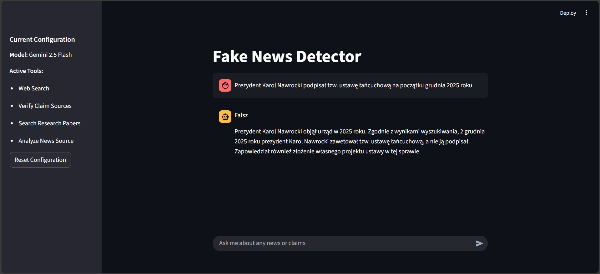
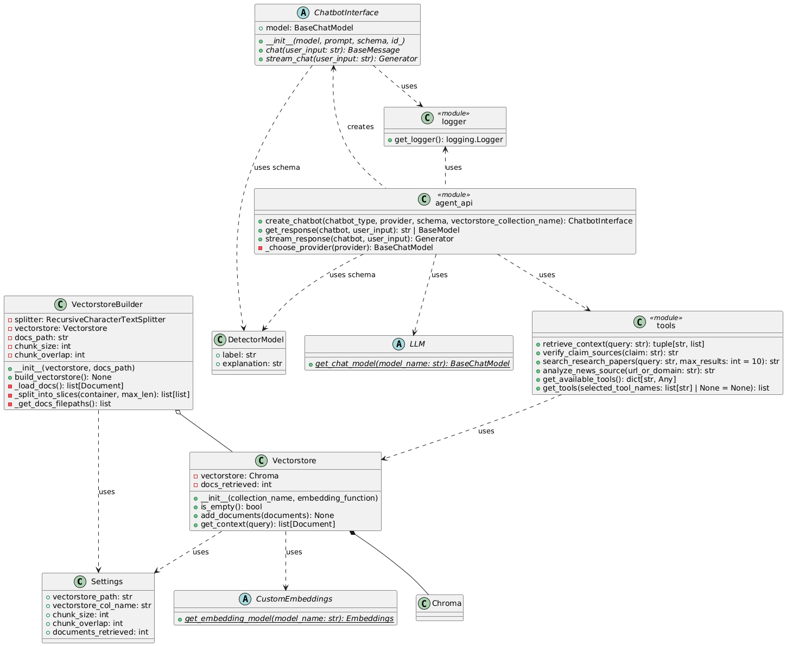
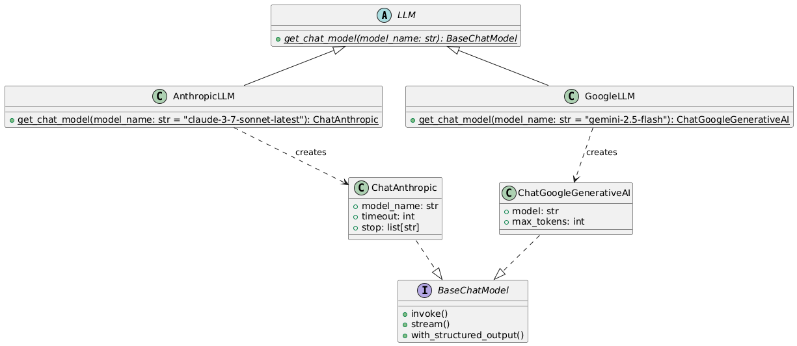
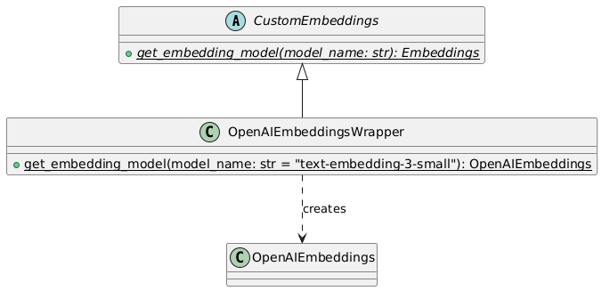
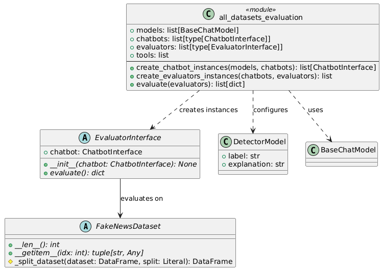
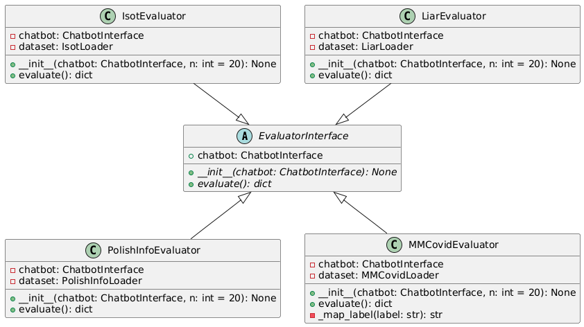
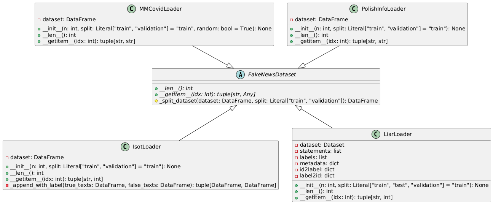

# Fake News Detection System

This project implements a sophisticated Fake News Detection system using Large Language Models (LLMs) and a multi-agent architecture. It leverages various tools such as Retrieval-Augmented Generation (RAG), web search, and academic paper search to verify claims and detect misinformation.



## Table of Contents

- [Overview](#overview)
- [Features](#features)
- [Architecture](#architecture)
  - [Chatbot Interface](#chatbot-interface)
  - [LLM Interface](#llm-interface)
  - [Tools](#tools)
  - [Evaluation](#evaluation)
- [Installation](#installation)
- [Configuration](#configuration)
- [Usage](#usage)
- [Project Structure](#project-structure)

## Overview

The system is designed to assist users in verifying news and claims by providing detailed analysis and evidence. It supports multiple LLM providers (Anthropic, Google, OpenAI) and offers different modes of operation, including a single-agent mode and a multi-agent consensus mode.

## Features

-   **Multi-LLM Support**: Compatible with Anthropic (Claude), Google (Gemini), and OpenAI models.
-   **Agent-Based Architecture**:
    -   **Plain Chatbot**: A simple conversational agent.
    -   **Agent Chatbot**: An agent equipped with tools to perform research and verification.
    -   **Multi-Agent Chatbot**: A system of multiple agents that debate and reach a consensus to improve accuracy.
-   **Tool Integration**:
    -   **RAG (Retrieval-Augmented Generation)**: Retrieves context from a vector store containing the MMCovid dataset.
    -   **Web Search**: Uses DuckDuckGo to verify claims against recent news and fact-checks.
    -   **Academic Search**: Searches arXiv for scientific papers and studies.
    -   **News Source Analysis**: Evaluates the credibility of news sources.
-   **Evaluation Module**: A comprehensive framework to evaluate the models against datasets like Liar, MMCovid, Isot, and PolishInfo.
-   **User Interface**: A user-friendly Streamlit application for interacting with the system.

## Architecture

The project follows a modular architecture with clear separation of concerns between the chatbot logic, tools, and evaluation metrics.



### Chatbot Interface

The core of the system is the `ChatbotInterface`, which defines the contract for all chatbot implementations.


### LLM Interface

The system supports multiple LLM providers through a unified interface.



### Tools

The agents have access to a suite of tools to gather information, including RAG which utilizes custom embeddings.



### Evaluation

The evaluation module assesses the performance of the chatbots on various datasets.







## Installation

### Prerequisites

-   Python 3.10 or higher
-   pip (Python package installer)

### Steps

1.  **Clone the repository**:
    ```bash
    git clone <repository-url>
    cd fake-news-detection
    ```

2.  **Create a virtual environment** (optional but recommended):
    ```bash
    python -m venv .venv
    source .venv/bin/activate  # On Windows: .venv\Scripts\activate
    ```

3.  **Install dependencies**:
    ```bash
    pip install -r requirements/agents.txt -r requirements/streamlit_app.txt
    ```

## Configuration

You need to set up your API keys to use the LLMs and search tools.

1.  Create a `.env` file in the root directory.
2.  Add the following environment variables:

```properties
# OpenAI API Key
OPENAI_API_KEY=your_openai_api_key_here

# Anthropic API Key
ANTHROPIC_API_KEY=your_anthropic_api_key_here

# Google API Key
GOOGLE_API_KEY=your_google_api_key_here
```

Ensure you have valid API keys for the models you intend to use.

## Usage

### Running the Streamlit App

To start the user interface, run the following command from the project root:

```bash
python -m streamlit run streamlit-app/app.py
```

This will launch the application in your default web browser. You can then:
1.  Select the model provider (e.g., Google Gemini, Anthropic Claude).
2.  Configure the active tools.
3.  Enter a news claim or query to verify.

### Running Evaluations

To run the evaluation suite on the datasets:

```bash
python -m evaluation.all_datasets_evaluation
```

## Project Structure

```
fake-news-detection/
├── agents/                 # Core agent logic and tools
│   ├── chatbot/            # Chatbot implementations (Plain, Agent, Multi-Agent)
│   ├── llms/               # LLM configurations
│   ├── models/             # Pydantic models for structured output
│   └── vectorstores/       # Vector database management
├── evaluation/             # Evaluation scripts and datasets
│   ├── data/               # Dataset files
│   ├── isot/               # ISOT dataset specific code
│   ├── liar/               # LIAR dataset specific code
│   ├── mmcovid/            # MMCovid dataset specific code
│   └── polish_info/        # PolishInfo dataset specific code
├── knowledge_base/         # Data for RAG (Vectorstore)
├── requirements/           # Project dependencies
├── streamlit-app/          # Frontend application
└── tests/                  # Unit and integration tests
```
